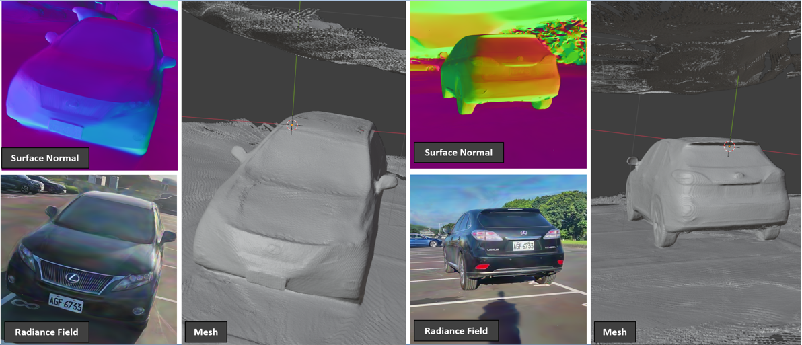
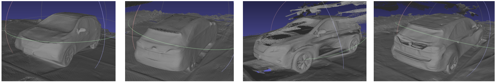
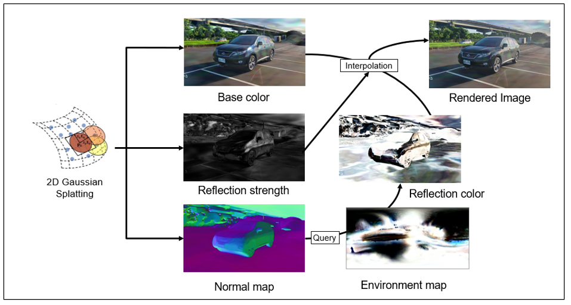

# 2D Gaussian Splatting with Deferred Reflection
Huang, Cheng-Ning<br>

[poster](./poster.pdf)


This project aims at improving the mesh extraction of 2D Gaussian Splatting by adding a deferred reflection step.


Comparison between 2D Gaussian Splatting with Deferred Reflection (ours) and 2D Gaussian Splatting. The left image is the result of 2D Gaussian Splatting with Deferred Reflection, and the right image is the result of 2D Gaussian Splatting. The right image has better mesh extraction.

## Abstract
This project aims to expedite vehicle removal following accidents through reconstructing 3D scene for evidence collection. However, extracting perfect meshes from 3D Gaussian splatting is challenging due to its volumetric nature. Therefore, we utilizes surfel gaussian splatting that support a view-consistent radiance field by using planar disks instead of 3D blobs. To address reflections, we adopted a three-stage deferred reflection training strategy, which prevents surface holes in the generated meshes.


The above figure shows the rendering path of our method. The first stage is the 2D Gaussian Splatting, which generates the initial radiance field. The second stage is the deferred reflection, which generates the reflection field.

## Installation
---
First, please setup the environment of [2DGS](https://github.com/hbb1/2d-gaussian-splatting/tree/main). Then run the following code to install the submodules.

```
pip install submodules/cubemapencoder
pip install submodules/diff-surfel-rasterization_c3
pip install submodules/diff-surfel-rasterization_c4
pip install submodules/simple-knn
```

## Train
Please use `train.py` to train the model.
```
python -u train.py -s data/photo/scooters/ --eval \
        --iterations 61000 --project_name default
```


## Render

## Viewer

- We implemented a viser viewer to visualize the results.Please refer to [2DGS-DR-viser-viewer](https://github.com/HCN1222/2DGS-DR-viser-viewer).
- The viewer is based on [2D-GS-Viser-Viewer](https://github.com/hwanhuh/2D-GS-Viser-Viewer) by [hwanhuh](https://github.com/hwanhuh).

```
```
## Dataset
Please download the dataset [here]().